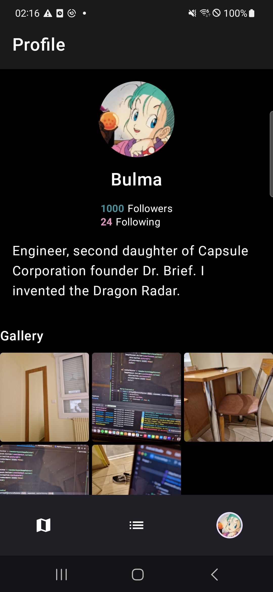
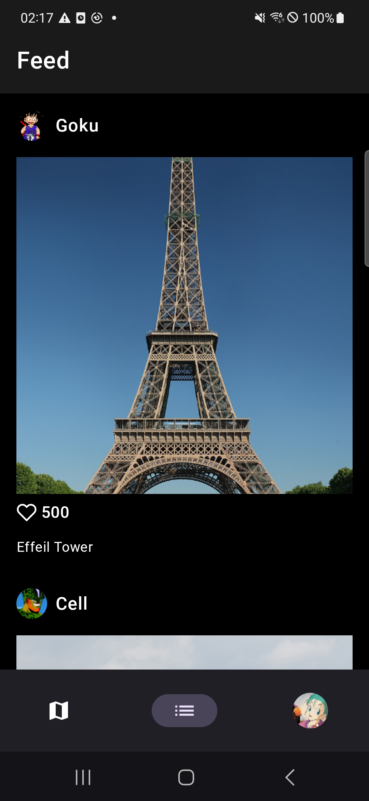
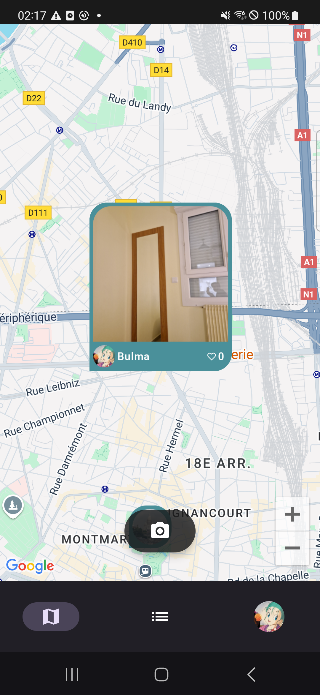
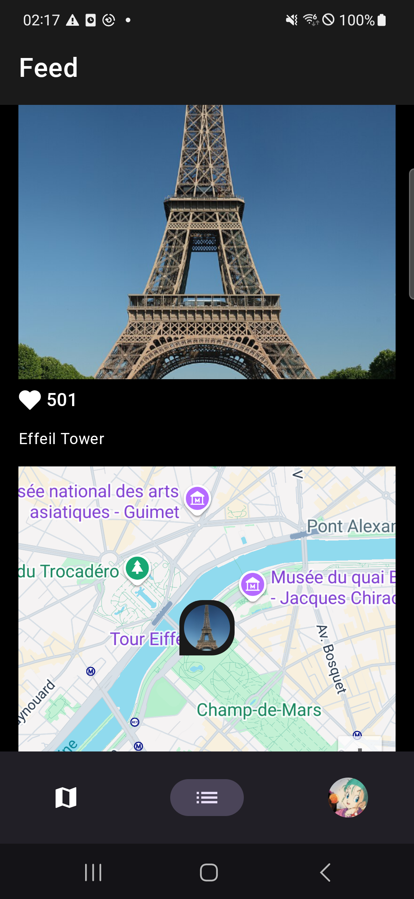
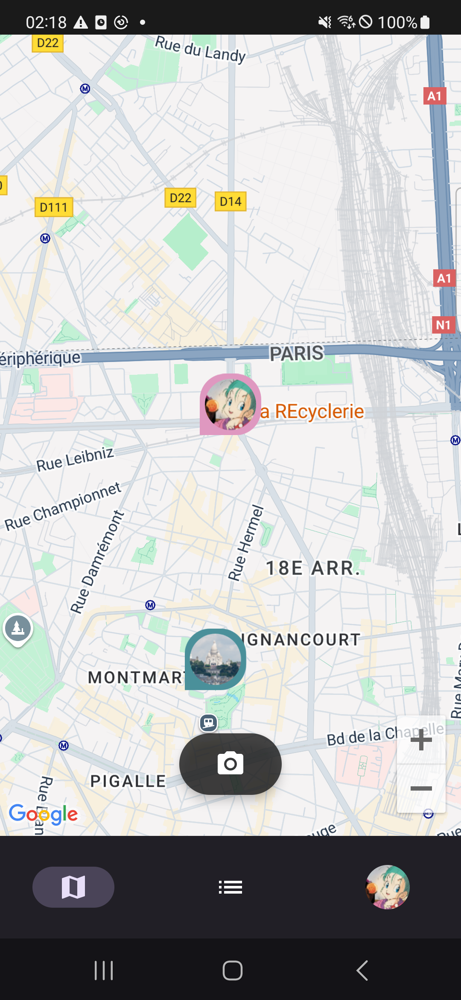
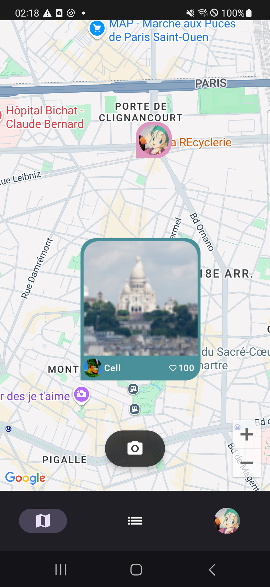
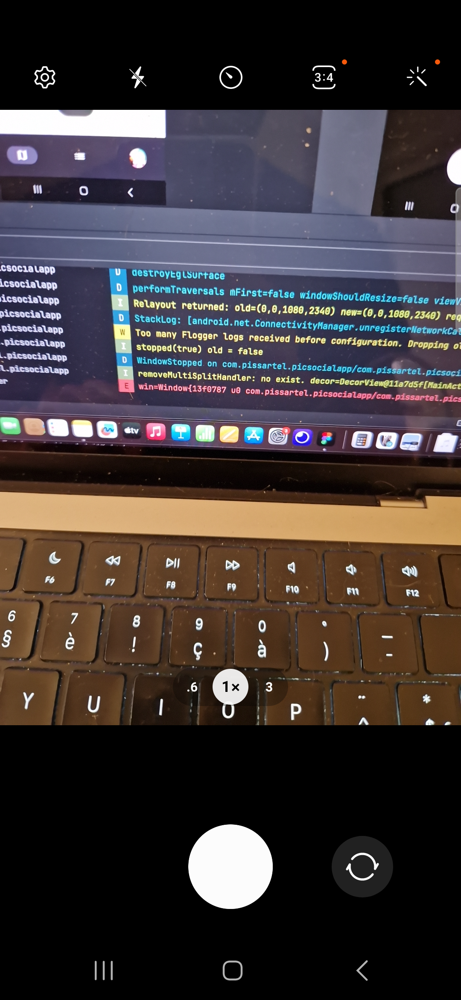

## Bulmap

Bulmap’s vision is to **redefine local social interactions** by creating a **real-time, geolocated platform** where users can **capture and explore life happening around them**. Our goal is to **bring people closer** by connecting those in the same area and **promoting local events, artisans, and small businesses**.

We aim to **foster community discovery and interaction**, turning the app into a hub for **real-time experiences**. Users can immerse themselves in what’s happening nearby, **support local initiatives**, and **build stronger connections** with their surroundings, while brands and creators engage authentically with their audience.

Ultimately, we’re building a **social experience where spontaneity and presence take center stage**, offering businesses an **organic, highly targeted way** to connect with the right audience.

